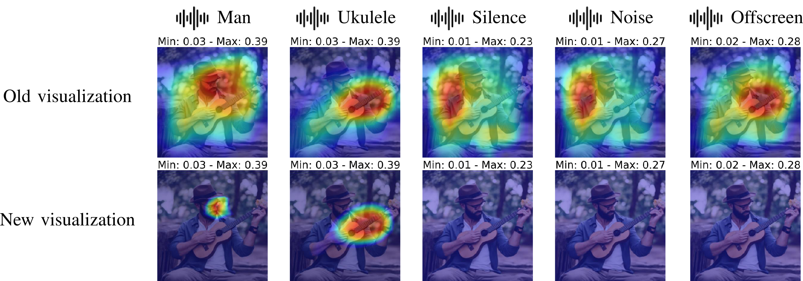
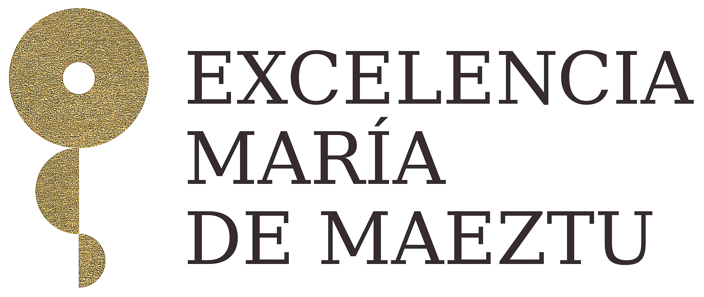

# A Critical Assessment of Visual Sound Source Localization Models Including Negative Audio

The official code for ICASSP2025 submitted paper `A Critical Assessment of Visual Sound Source Localization Models Including Negative Audio`.

>  **[A Critical Assessment of Visual Sound Source Localization Models Including Negative Audio](https://arxiv.org/abs/2410.01020)**  
>
> **[Project Page](https://xavijuanola.github.io/vssleval/)**
>
> [Xavier Juanola](https://xavijuanola.github.io/), [Gloria Haro](https://www.upf.edu/web/gloria-haro), [Magdalena Fuentes](https://steinhardt.nyu.edu/people/magdalena-fuentes)
>
>  arXiV 2024




**Abstract**: The task of Visual Sound Source Localization (VSSL) involves identifying the location of sound sources in visual scenes, integrating audio-visual data for enhanced scene understanding. Despite advancements in state-of-the-art (SOTA) models, we observe three critical flaws: i) The evaluation of the models is mainly focused in sounds produced by objects that are visible in the image, ii) The evaluation often assumes a prior knowledge of the size of the sounding object, and iii) No universal threshold for localization in real-world scenarios is established, as previous approaches only consider positive examples without accounting for both positive and negative cases. In this paper, we introduce a novel test set and metrics designed to complete the current standard evaluation of VSSL models by testing them in scenarios where none of the objects in the image corresponds to the audio input, i.e. a negative audio. We consider three types of negative audio: silence, noise and offscreen. Our analysis reveals that numerous SOTA models fail to appropriately adjust their predictions based on audio input, suggesting that these
models may not be leveraging audio information as intended. Additionally, we provide a comprehensive analysis of the range of maximum values in the estimated audio-visual similarity maps, in both positive and negative audio cases, and show that most of the models are not discriminative enough, making them unfit to choose a universal threshold appropriate to perform sound localization without any a priori information of the sounding object, that is, object size and visibility.

**Keywords**: Sound Source Localization, Audio-Visual Learning

*****************

## Index
- [Environment](#environment)
- [Data Preparation](#data-preparation)
- [Evaluation and Inference](#evaluation-and-inference)
- [Citation](#citation)
- [Acknowledgement](#acknowledgement)

*****************

## Environment
- Python == 3.7.10
- PyTorch == 1.13.1
- CUDA_VERSION == 11.7

### Create environment
```bash
conda create -n env_name python=3.7.10
```

### Activate environment
```bash
conda activate env_name
```

### Install Dependencies
```bash
pip install -r requirements.txt
```

## Data Preparation
### VGGSound dataset

- Test data structure


```txt
├── VGGSound-Sources
│   ├── audio
│   │   ├── __2MwJ2uHu0_000004.wav
│   │   ├── ...
│   ├── frames
│   │   ├── __2MwJ2uHu0_000004.jpg
│   │   └── ...
│   ├── annotations.json
│   ├── class_files_dict.json
└── 
```

```txt
├── IS3 Dataset
│   ├── audio_wav
│   │   ├── male_ukulele_9253_male.wav
│   │   ├── ...
│   ├── images
│   │   ├── male_ukulele_9253_male.jpg
│   │   └── ...
│   ├── IS3_annotation.json
│   ├── class_files_dict.json
└── 
```

## Evaluation and Inference

### Model weights & Metadata
Please download the pretrained model weights from the Google Drive link and put them in the `checkpoints` folder. Please also download the `metadata` folder from the Google Drive link and put the entire directory on the root directory of the project.

- [Google Drive](https://drive.google.com/drive/folders/1ZFec6crf1smf_tp3u5uRUJXw4lGTsOLB?usp=sharing)


### Scripts
- Evaluate the models (Change the path to the VGGSS and IS3 datasets in `eval_models.sh` file):
```bash
bash eval_models.sh
```
- Run inferences on the models (Change the path to the VGGSS and IS3 datasets in `eval_models.sh` file):
```bash
bash infer_models.sh
```

## Citation
If you find this code useful, please consider giving a star ⭐ and citing us:

```bibtex
@misc{juanola2024criticalassessmentvisualsound,
      title={A Critical Assessment of Visual Sound Source Localization Models Including Negative Audio}, 
      author={Xavier Juanola and Gloria Haro and Magdalena Fuentes},
      year={2024},
      eprint={2410.01020},
      archivePrefix={arXiv},
      primaryClass={cs.CV},
      url={https://arxiv.org/abs/2410.01020}, 
}
```
*****************

The code in this repository is based on the code shared in [SSLalignment](https://github.com/kaistmm/SSLalignment/tree/main).

## Acknowledgement
The authors acknowledge support by the FPI scholarship PRE2022-101321, Maria de Maeztu CEX2021-001195-M/AEI/ 10.13039/501100011033, MICINN/FEDER UE project ref. PID2021-127643NB-I00, Fulbright Program, and Ministerio de Universidades (Spain) for mobility stays of professors and researchers in foreign higher education and research centers.

<p align="center">
  
  &nbsp;&nbsp;&nbsp;
  
   &nbsp;&nbsp;&nbsp;
  
   &nbsp;&nbsp;&nbsp;
  
</p>

<p align="center">
  
  &nbsp;&nbsp;&nbsp;
  
   &nbsp;&nbsp;&nbsp;
  
</p>
